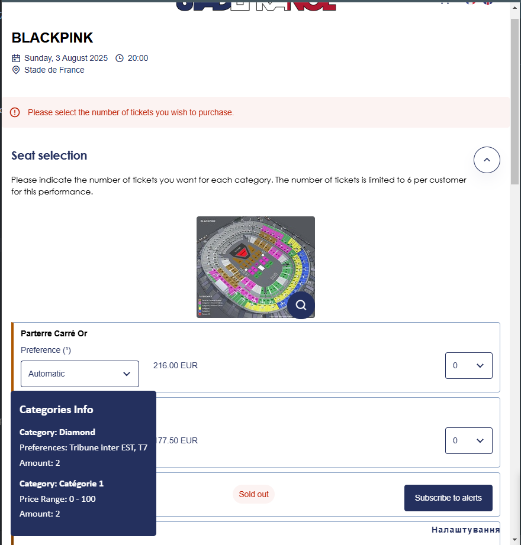
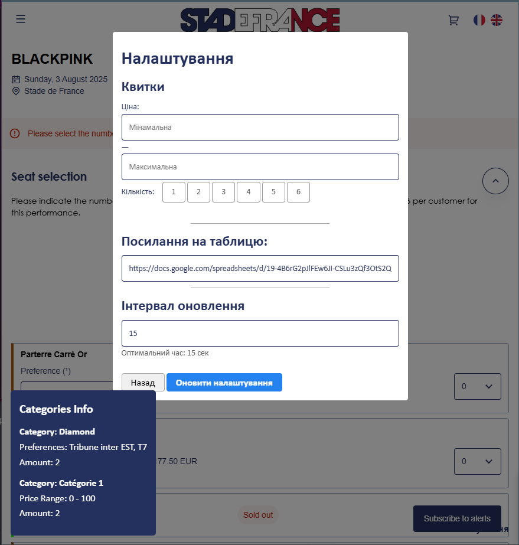
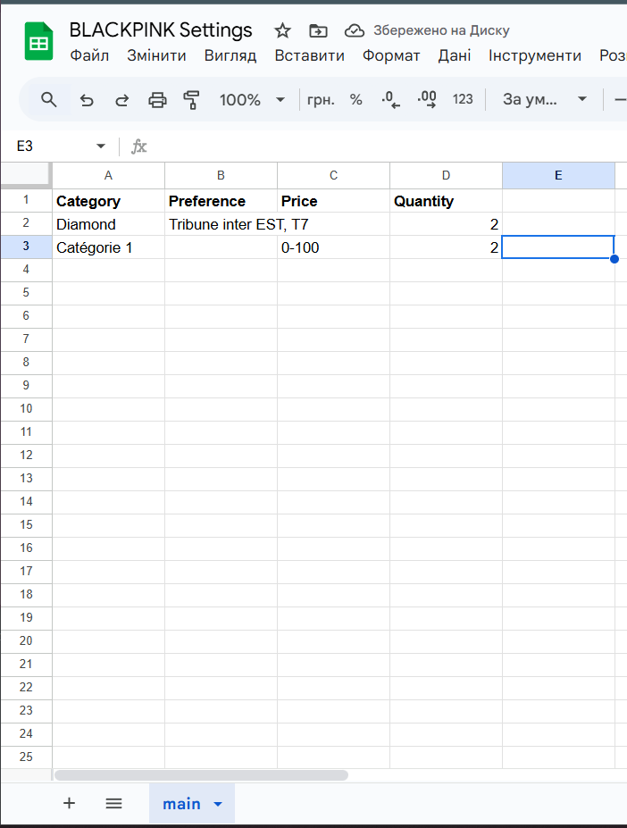

browser extension-clicker that tries to catch tickets on stadefrance events

# How it works
1. It saves settings from integrated interface in IndexedDB
2. Parses necessary data about existing tickets on page
3. Filters that data by our settings
4. If there are fit tickets, selects necessary amount of tickets and tries to buy
5. If no tickets are found or event tickets are empty, tries to refresh page after specified in interface time.

# Requirements

- Running Google Chrome Instance, or Chromium based
- Google Sheets (optional)
- Python 3 (to run tests)

# Get Started

1. Open Google Chrome browser instance 
2. Enter "extensions" menu in settings
3. Turn on "Developers mode" in right-top corner
4. Import stadefrance_extension folder
5. Enter desired event page, for example https://billets.stadefrance.com/selection/event/date?productId=10229336225896&lang=en
6. Setup you Google Sheets following the example in [Spreadsheets Configuration](#spreadsheets-configuration) (optional)
7. Enter desired settings in bot interface and run

# Interface 

on the bottom-right corner should be "Settings" button that leads to [Interface Settings](#active-interface-settings-sample)


## Active Interface Sample

Interface in the bottom-left corner appears after initiating settings in interface



## Active Interface Settings Sample

An interface of settings



## Choose Your Setup Mode

You're allowed to choose which kind of preferences you want to use

- Simplified version is designed to work out of the box, just enter necessary fields in interface to run bot
- Spreadsheets version used for filtering tickets by categories, preferences, amount and price.

# Spreadsheets Configuration

create google sheets with following attributes:

|Name|Description|Available Values|Required|
|----|-----------|----------------|--------|
|Category|Desired categories name divided by ", " that wil be used as a whitelist |String: "Category 1, Seated Only"|Yes|
|Preferences|Preferences for certain category, can be used without category. Divided by ", "|String: "Tribune inter EST, T7"|No|
|PRICE|Sorting tickets by price range using "-" separator, min-max|String: "599-1000"|No|
|Quantity|An amount of desired tickets|Int: 5|Yes|

## Google Sheets configuration sample


# Testing

install requirements ```pip install -r requirements.txt```

## Scripts

[test_settings_basic.py](tests/test_settings_basic.py) - tests interface basic configuration and its existence

[test_settings_advanced.py](tests/test_settings_advanced.py) - uses spreadsheets for advanced configuration and checks the existence of elements
